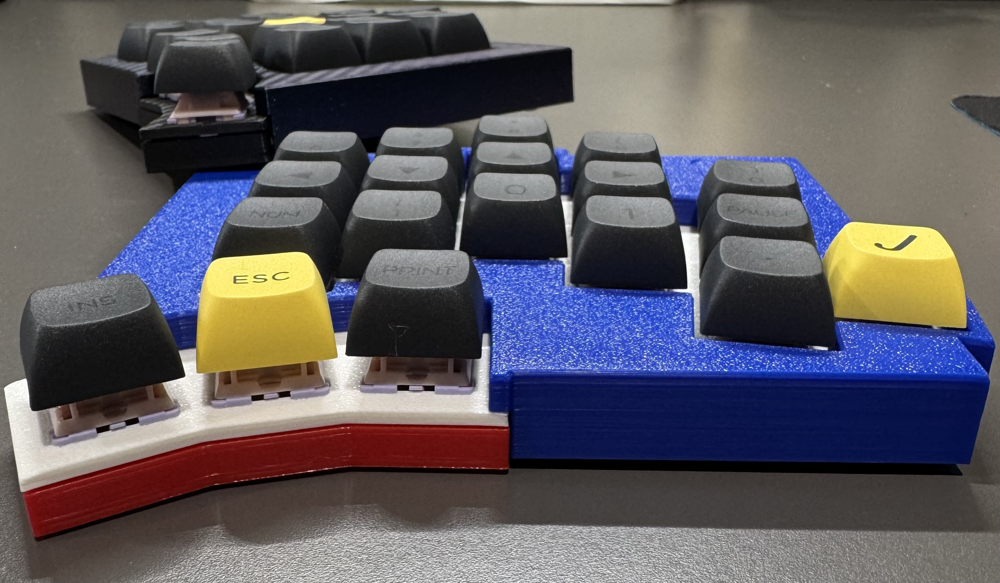

# Low Profile case for Wireless Totemx

The 3MF file is shared for a low profile case specifically designed for the wireless build of TOTEMX

Tweaks introduced to the original TOTEMX case bottom plate and the middle/top plate of the [wireless build case](https://github.com/felixJR123/TOTEMX-Wireless-Case):

- 2mm height removed from top/bottom plate
- cut-outs on the bottom plate to fit sockets (bottom plate is now snugly fit to PCB)
- 3mm x 2mm magnet insert holes for middle/top plate to enable screw-less assembly

The step file of low profile case bottom plate is added for people with [PCB compatibility issue](https://github.com/azhizhinov/TOTEMX/issues/9) to modify.
