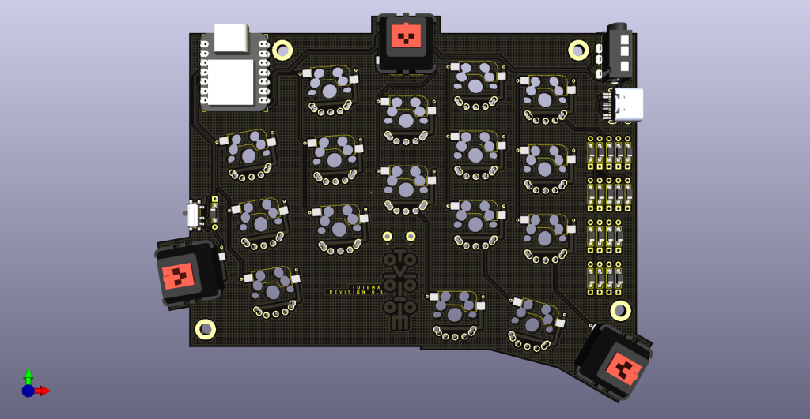
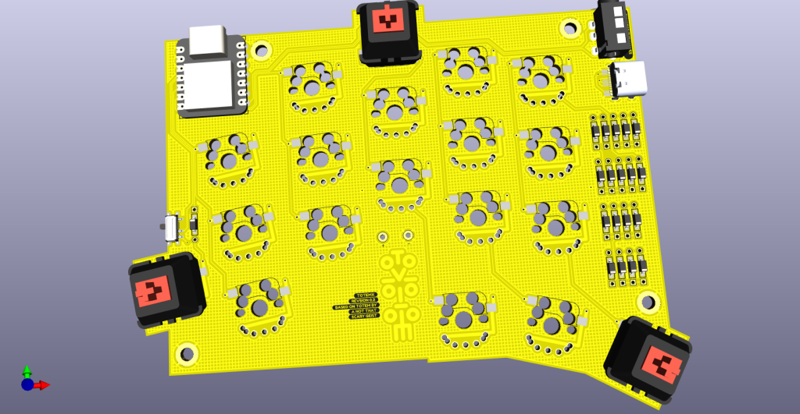
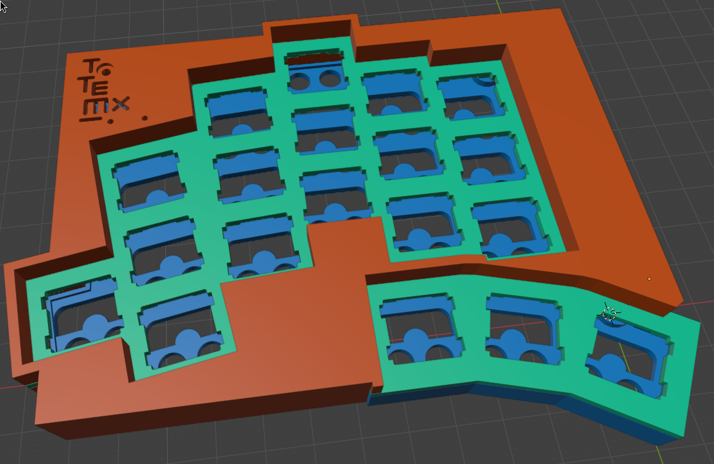
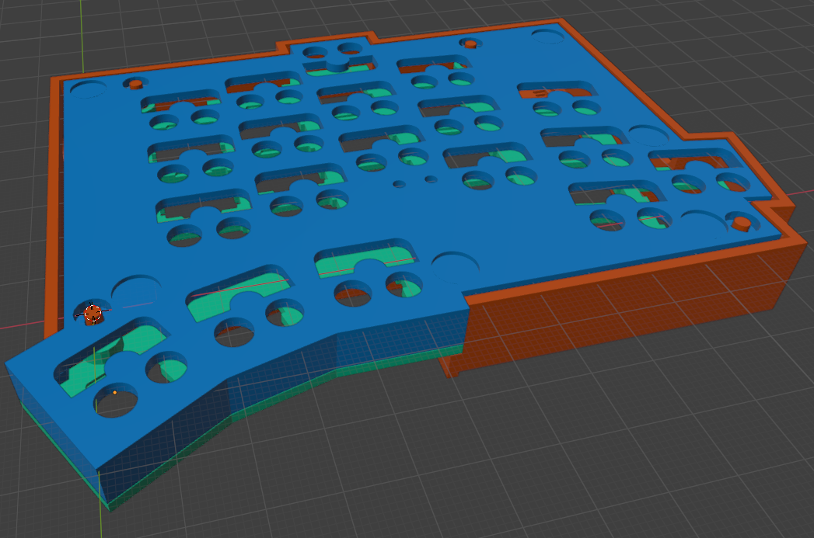
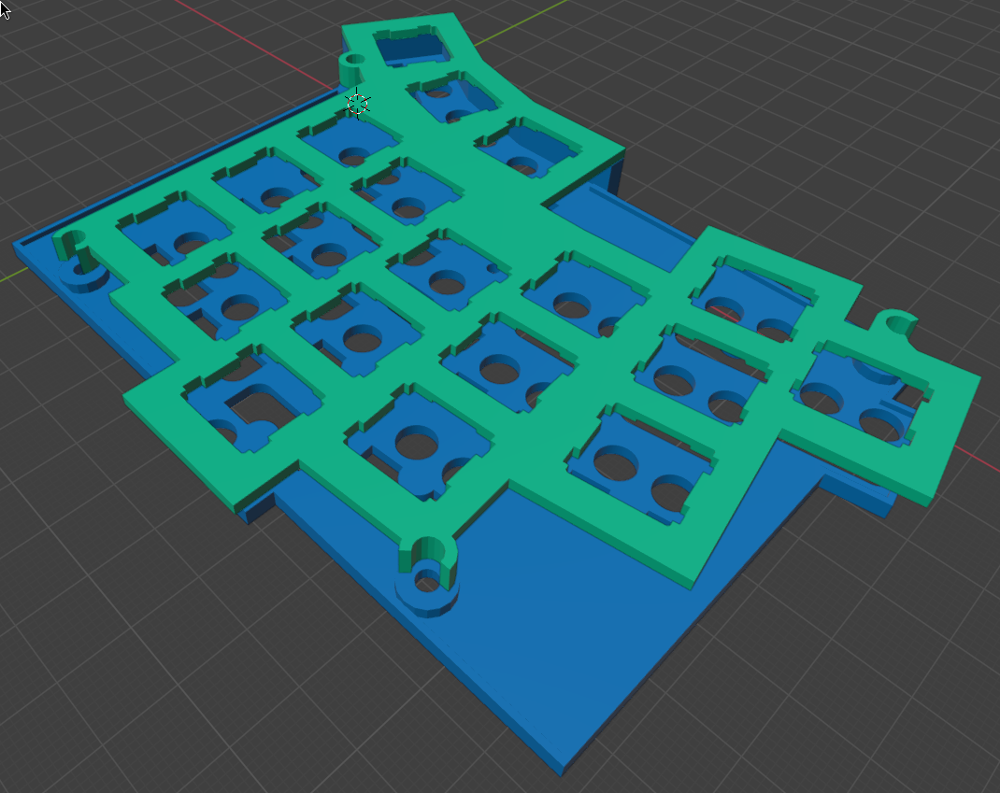
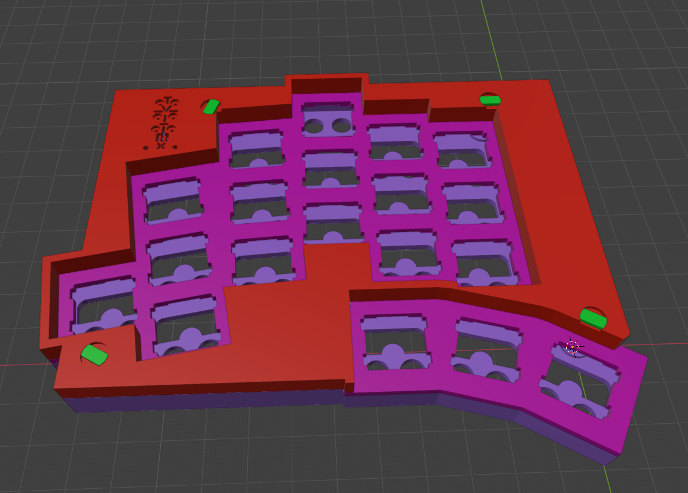

# TOTEMX
TOTEMX is a 38 keys column-staggered split keyboard. It meant to be used with a Seed Studio XIAO RP2040 or nRF52840.
TOTEMX is a replica of the famous TOTEM by GEIGEIGEIST for MX spacing (19.05x19.05mm) switches like Cherry MX.

https://github.com/GEIGEIGEIST/TOTEM

TOTEMX shares the same firmware as of the original TOTEM.

Case with integrated nails.

Another case with the independent nails.

There are another versions for the case, designed spetially for wireless builds.
https://github.com/felixJR123/TOTEMX-Wireless-Case
